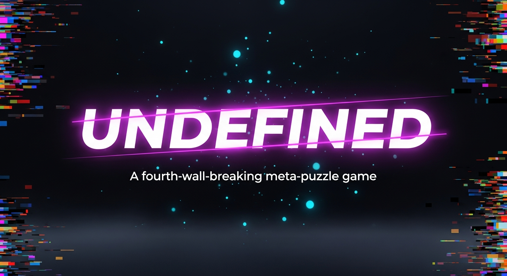

# Undefined-Game
A fourth-wall-breaking meta-puzzle game. 6 chapters, 40 achievements, WebGL effects, and a story that knows you're playing it.

There is no game. Do not click anything.

UNDEFINED is a complete, original meta-puzzle browser game that breaks the fourth wall from the very first screen. A story unfolds across 6 chapters — each one shifting in tone, mood, and gameplay — as the line between the player and the game begins to dissolve.

FEATURES
• 6 Chapters: The Denial · The Desktop · The Intruder · The Machine · The Collapse · The Choice
• 4 Endings: Acceptance, Deletion, Merge, and a hidden Secret ending
• 40 Achievements to unlock across your playthrough
• 35+ secrets, including a hidden Anomaly Vault of 10 bonus puzzles
• Reflex Mini-Games: catch glitches, stabilize cores, type to resist corruption, hold the channel
• Logic Puzzles: port wiring, calibration, ordering challenges
• Corruption, Trust, and Memory systems that respond to your choices
• Procedural WebAudio soundtrack — each chapter has its own musical key, scale, and timbre
• WebGL post-processing: CRT scanlines, bloom, chromatic aberration, screen tear, particles
• Full save system with autosave, manual save, and in-fiction corruption events
• 100% offline after first load — no internet required, no external data collected

HOW TO PLAY
Click the extension icon to open the game in a full browser tab. Use your mouse to click through dialogue and interact with puzzles. Press Esc or click ≡ to access the pause menu (Save, Achievements, Settings).

Headphones are strongly recommended. There is nothing in here. Stop looking.

▸ Find more browser games: https://web-gam-dev.blogspot.com
